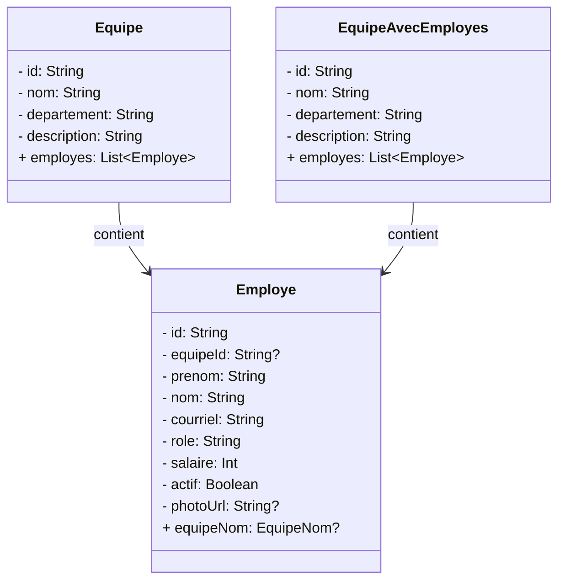

# Examen : Introduction au développement Android (15%)

## Objectif(s)
- Démontrer la capacité à programmer un prototype d'application Android qui manipule des données provenant d'une base de données Supabase.

## Éléments de compétence visé(s)
- Analyser le projet de développement de l'application
- Préparer l'environnement de développement informatique
- Programmer l'interface mobile
- Programmer la logique applicative du côté client
- Contrôler la qualité de l'application

## Modalités de l'évaluation
- Il s'agit d'un travail individuel.
- Faire une copie personnelle du code fourni (fork) et le compléter selon les instructions de ce document à l'aide d'au moins un archivage.
- Ajouter l'enseignant au projet.
- Remettre le code sur GitLab avant la fin du cours et avant de quitter la classe.
- Aucun retard ne sera accepté – le dernier archivage avant l'heure de sortie sera la version corrigée.
- Mentionner la source de tout extrait de code qui n'a pas été écrit dans le cadre de cette évaluation (exercices, solutionnaires, notes de cours, internet, etc.)
- L'utilisation d'IA générative est interdite.
- La durée prévue de l'examen est de 1h20 si toutes les activités d'apprentissage suggérées ont été effectuées et si vous effectuez les opérations dans l'ordre suggéré.

## Contexte

Dans cette évaluation, vous réaliserez une application de gestion d'employés pour une entreprise fictive. L'application permet de consulter des employés et des équipes, et d'ajouter ou modifier des employés via un formulaire.

### Diagramme de classes

### Employe
- Un employé appartient à une équipe (optionnel)
- Un employé peut être actif ou inactif
- Un employé peut avoir une photo de profil (URL)

### Equipe
- Une équipe contient plusieurs employés
- Une équipe appartient à un département

## Instructions

- [ ] Lancer l'application et explorer les écrans existants pour vous familiariser avec le projet.
- [ ] Afficher les `@TODO` dans l'IDE. (View --> Tool Windows --> TODO)
- [ ] Compléter la méthode `ajouterEmploye` dans `SupabaseClient` pour insérer un nouvel employé dans la base de données.
  - **N.B.** une classe `EmployeAjout` a déjà été créée pour vous.  
- [ ] Compléter la méthode `modifierEmploye` dans `SupabaseClient` pour mettre à jour un employé existant dans la base de données.
- [ ] Compléter la méthode `soumettreFormulaire` dans `EntrepriseViewModel` pour gérer l'ajout **ou** la modification d'un employé selon le contexte (présence ou non d'un `employeId`). Après soumission, l'application doit retourner à la liste des employés.
  - Pour la phpto de profil, vous devez insérer l'URL qui respecte le format suivant: https://picsum.photos/seed/prénom-nom/200 . **Ne pas l'ajouter au formulaire.** 
- [ ] Gérer les changements de valeur de chaque champ du formulaire dans `FormulaireEmploye` en envoyant les bonnes actions au ViewModel. Ajouter les actions manquantes dans `EntrepriseActions` si nécessaire.
- [ ] Gérer la sélection d'une équipe dans le menu déroulant du formulaire.
- [ ] Gérer le clic sur le bouton **Enregistrer** du formulaire pour déclencher la soumission.
- [ ] Afficher l'image de profil de l'employé à partir de son URL dans `CarteEmploye` (liste des employés) et dans `CarteMembreEquipe` (détails d'une équipe). Conserver le `contentScale` et le `modifier` existants pour le style.
- [ ] Compléter la récupération des employés (`getEmployes`) pour également récupérer le **nom de l'équipe** de chaque employé à l'aide de la relation dans la base de données Supabase (jointure).

## Grille de correction

| **Élément de compétence**               | **Éléments évalués**                                                                                                                          | **Pondération** |
|-----------------------------------------|-----------------------------------------------------------------------------------------------------------------------------------------------|-----------------|
| Programmer la logique applicative       | Récupération correcte des données avec relation (nom d'équipe). Ajout et modification d'un employé via Supabase. Logique du ViewModel complète (soumission, navigation). | 8               |
| Programmer l'interface mobile           | Gestion correcte des champs du formulaire et de leurs états. Affichage des images de profil. Utilisation appropriée des composables Compose.  | 5               |
| Contrôler la qualité de l'application   | Application fonctionnelle et utilisable de bout en bout dans le navigateur/émulateur.                                                         | 2               |